# EV Data Analysis: Survey Findings & National Trend Analysis (2024–2026)

**Author:** Vivek Kumar  
**Survey Date:** March 2024 | **Updated:** June 2026  
**Sample Size:** 51 respondents  
**Data Sources:** Primary (Google Forms Survey) + Secondary (VAHAN, EVreporter, IEA, JMK Research, WRI)

---

## Section 1 — Survey Data Analysis (Primary Research, March 2024)

This section covers what our survey of 51 respondents revealed in March 2024, with commentary on how those responses compare to what actually happened in India's EV sector over the next two years.

### 1.1 Respondent Profile

**Age Distribution of Respondents:**

| Age Group | Count | Percentage |
|-----------|-------|------------|
| 16–18     | 3     | 5.9%       |
| 20        | 16    | 31.4%      |
| 22        | 10    | 19.6%      |
| 25        | 3     | 5.9%       |
| 27        | 3     | 5.9%       |
| 33        | 3     | 5.9%       |
| 55+       | 1     | 2.0%       |
| Others    | 12    | 23.5%      |

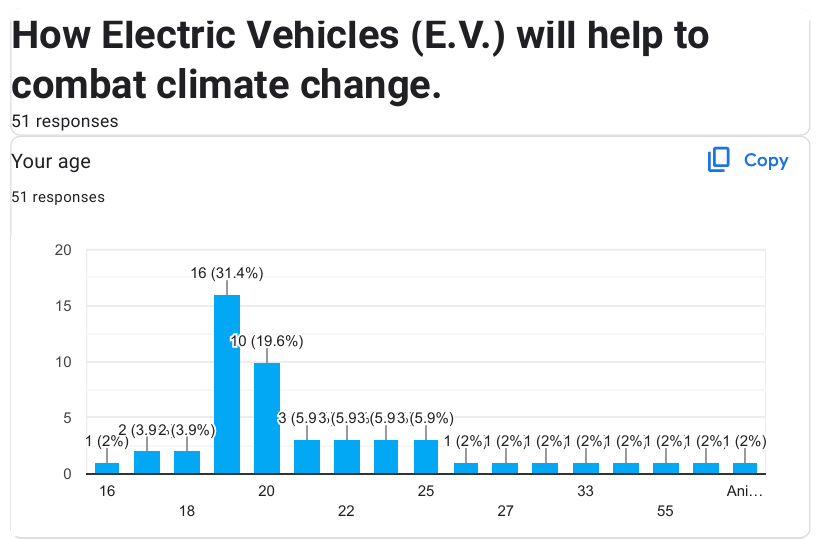

**Observation:** The sample skews young and urban, which is expected given that the survey was distributed primarily through college networks and online channels. The findings reflect the opinions of educated urban youth more than the general Indian population. This is a limitation — 70% of India is rural, and EV adoption dynamics in rural areas are very different.

---

### 1.2 EV Usage: Have Respondents Actually Used an EV?

| Response | Count | Percentage |
|----------|-------|------------|
| Yes      | 15    | 29.4%      |
| No       | 36    | 70.6%      |

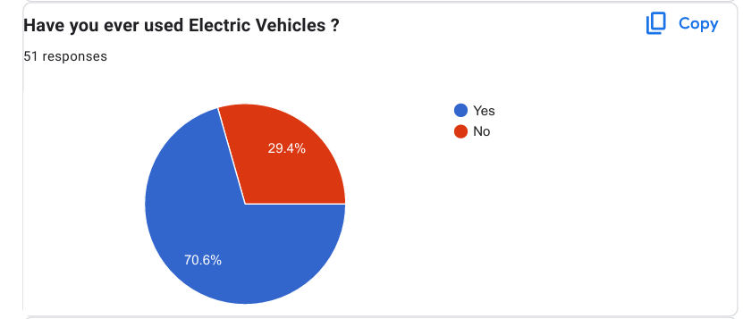

**What this tells us:** In March 2024, roughly 7 in 10 respondents had never actually used an electric vehicle. This is important context for interpreting all other survey responses — most opinions came from people who had not experienced EVs firsthand. Their perceptions were shaped by news coverage, social media, and word of mouth, not personal experience.

**2026 Update:** India's EV penetration reached **8.27%** of all vehicle sales in FY2026. The number of people who have personally used an EV has grown substantially, particularly in urban areas. An updated survey today would likely show a much higher "Yes" response, especially among the 20–25 age group.

---

### 1.3 Preferred EV Type in Daily Life

| Category                      | Count | Percentage |
|-------------------------------|-------|------------|
| Public Vehicle (e-bus/metro)  | 33    | 64.7%      |
| Personal Vehicle              | 21    | 41.2%      |
| Online Platform (Electric Cabs)| 11   | 21.6%      |
| None                          | 3     | 5.9%       |

*(Note: Multiple selections were allowed, so percentages exceed 100%)_*

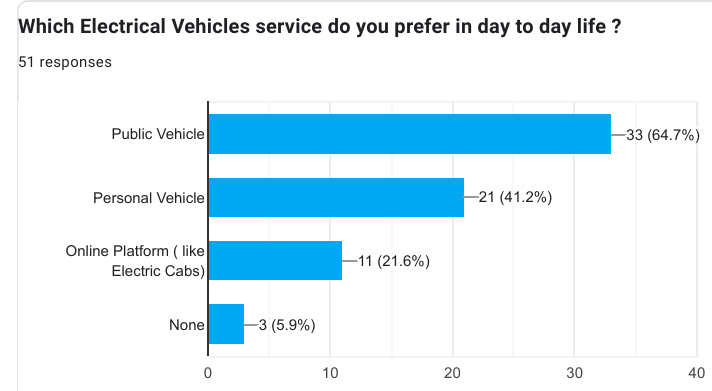

**Key Insight:** Most respondents preferred EVs in a public or shared context rather than as personal ownership. This aligns with economic reality — EVs have a higher upfront cost, and most urban youth in India rely on public transport or ride-hailing for daily commuting.

**2026 Update:** This is where India has actually made its most progress. Electric three-wheelers and e-rickshaws now make up approximately **35%** of all EV sales. E-buses are being inducted under PM E-Drive. The preference people expressed in 2024 for public EV usage has been validated by the market.

---

### 1.4 Purpose of Using EVs

| Reason            | Count | Percentage |
|-------------------|-------|------------|
| Environment Concern | 29  | 56.9%      |
| Availability      | 23    | 45.1%      |
| Cost Effectiveness| 23    | 45.1%      |
| Others            | 6     | 11.8%      |

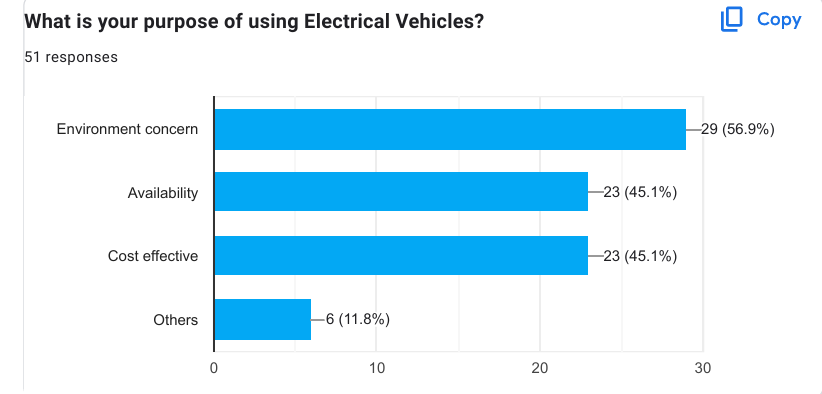

**Key Insight:** Environmental concern is the top stated reason, but the gap between environment (56.9%) and practical factors like availability and cost (45.1% each) is smaller than one might expect. People are motivated by both values and economics, roughly equally.

**What this means for policy:** Subsidies work because they address the cost barrier. But if the product is not available where people live, subsidies alone will not drive adoption. This explains why EV adoption remains concentrated in a handful of states — Uttar Pradesh, Maharashtra, Karnataka, Tamil Nadu, and Delhi account for about **50%** of all EV sales.

---

### 1.5 Future Travel Preference

| Preference                    | Percentage |
|-------------------------------|------------|
| Private EV                    | 49.0%      |
| Public EV                     | 39.2%      |
| Private Conventional Vehicle  | 2.0%       |
| Public Conventional Vehicle   | 9.8%       |

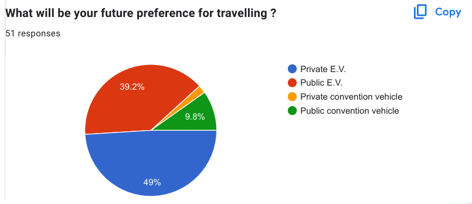

**Key Insight:** Nearly **90%** of respondents (combined Private EV + Public EV) said their future preference is electric. Only **12%** said they would continue using conventional vehicles. In 2024, most people had never used an EV — yet almost all of them said they wanted to switch to one.

This gap between current behaviour and future intent is the central story of India's EV market. The demand is there. The constraint is on the supply side — availability, affordability, and infrastructure.

---

### 1.6 Why People Do Not Buy Personal EVs

| Barrier          | Count | Percentage |
|------------------|-------|------------|
| High Cost        | 25    | 49.0%      |
| EV Infrastructure| 23    | 45.1%      |
| Long Charging Time| 22   | 43.1%      |
| Short Range      | 18    | 35.3%      |

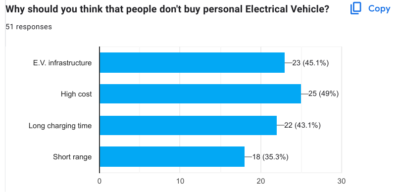

**2026 Validation — How Accurate Were These Concerns?**

| Barrier              | Validation                                                                                     |
|----------------------|-----------------------------------------------------------------------------------------------|
| High Cost            | Still accurate. EV four-wheelers are 20–40% more expensive than equivalent petrol vehicles.   |
| EV Infrastructure    | Completely validated. Delhi has 8,849 charging points against a requirement of 36,150.        |
| Long Charging Time   | Still a real issue for four-wheelers. Fast chargers exist but are limited.                   |
| Short Range          | Has improved with newer models but budget segment four-wheelers still face range anxiety.     |

**Conclusion:** Our respondents correctly identified all four major barriers in 2024. Two years later, infrastructure and charging time remain the biggest unresolved problems in India's EV transition.

---

### 1.7 How India Can Transition Completely to EVs

| Factor                  | Percentage |
|-------------------------|------------|
| Government Subsidy      | 41.2%      |
| EV Infrastructure       | 31.4%      |
| Strict Laws on ICE Vehicles | 11.8%  |
| Public Perception Change| 15.7%      |

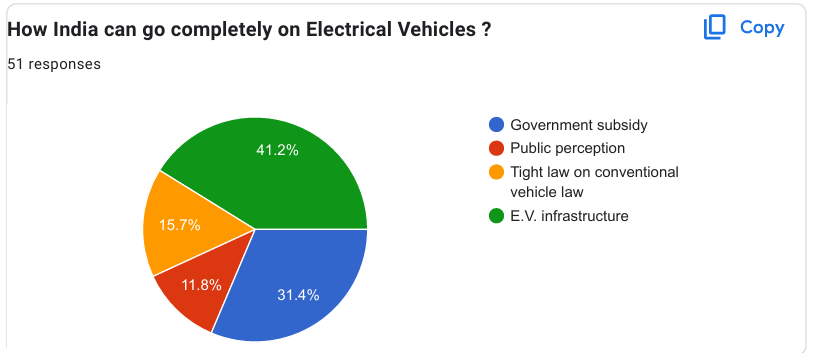

**Analysis:** Respondents overwhelmingly pointed to government action — subsidy and infrastructure — as the path to full EV adoption. They were largely right. The FAME schemes, PM E-Drive, and the Delhi EV Policy 2026 with its Rs. 3,954 crore outlay are exactly the kind of government-led push respondents identified as necessary.

---

### 1.8 Will EVs Phase Out Conventional Vehicles?

| Estimate        | Percentage |
|-----------------|------------|
| 60% – 70%       | 8.2%       |
| 70% – 80%       | 38.8%      |
| 80% – 90%       | 53.1%      |
| 90% – 100%      | 0%         |

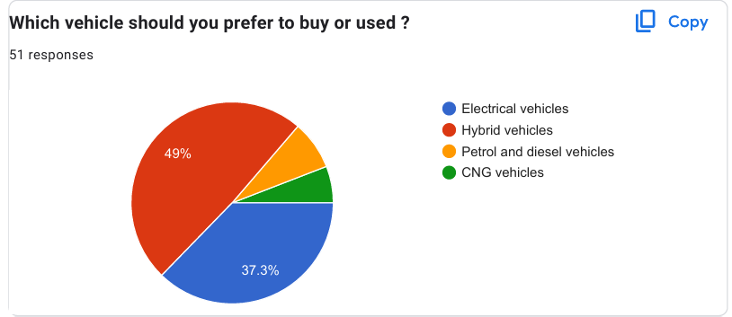

**Analysis:** Most respondents expected EVs to replace **70–90%** of conventional vehicles. The national 2030 target of **30%** EV penetration in private cars suggests the 80–90% estimate is too optimistic overall. However, for two-wheelers and three-wheelers, the 80% target is actually government policy. By segment, respondents may be more right than they seem.

---

### 1.9 Are EVs Useful for Climate Combat?

| Response         | Percentage |
|------------------|------------|
| Strongly Agree   | 47.1%      |
| Agree            | 25.5%      |
| Neutral          | 13.7%      |
| Disagree         | 9.8%       |
| Strongly Disagree| 3.9%       |

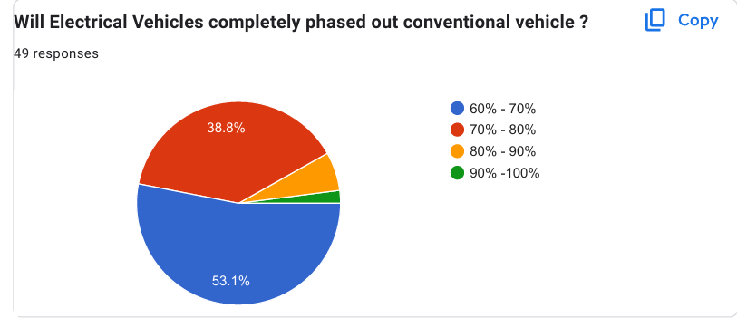

**Analysis:** **72.6%** of respondents agree or strongly agree that EVs help combat climate change. This is directionally correct but optimistic. EVs in India, given the current coal-heavy electricity grid, save approximately **20% fewer** lifecycle CO₂ emissions compared to ICE vehicles (IEA, 2024). Between 2020 and 2024, EV adoption prevented approximately **10 million tonnes** of CO₂ emissions in India (WRI India, 2024) — a real number, and one that will grow as India's grid gets cleaner.

---

### 1.10 Key Factors When Buying an EV Over a Conventional Vehicle

| Factor        | Count | Percentage |
|---------------|-------|------------|
| Low Maintenance | 28  | 54.9%      |
| Low Noise     | 22    | 43.1%      |
| Car Design    | 16    | 31.4%      |
| Other         | 16    | 31.4%      |

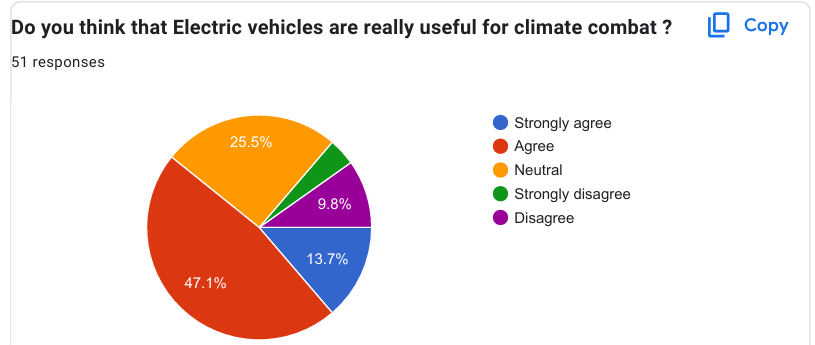

**Key Insight:** People are pragmatic. **Low maintenance** — not environment, not technology, not design — is the top purchase motivator. This directly connects to the Ola Electric crisis. The brand promised low maintenance as a core EV benefit. The 10,644 complaints about service delays and recurring defects directly undercut that promise. The highest-valued selling point became the biggest source of disappointment.

---

### 1.11 Survey Response Overview

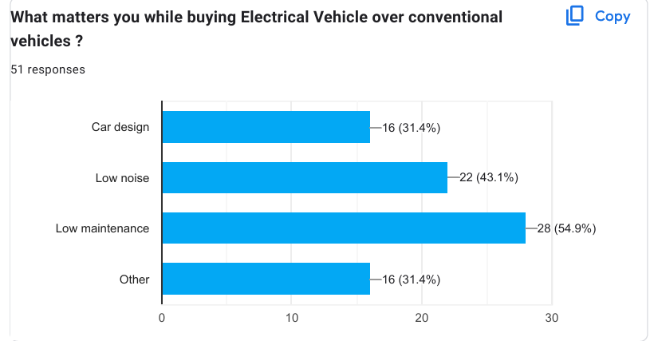

---

## Section 2 — National Trend Analysis (Secondary Data, 2022–2026)

### 2.1 India EV Sales Growth: 2022–2026

| Year   | Total EV Sales   | YoY Growth | EV Market Share |
|--------|------------------|------------|-----------------|
| 2022   | ~0.7 million     | —          | ~2.5%           |
| 2023   | ~1.6 million     | ~128%      | ~5.5%           |
| 2024   | ~1.95 million    | ~24%       | ~7%             |
| 2025   | ~2.27 million    | ~16.3%     | ~8%             |
| 2026*  | ~2.7 million     | ~19%       | ~8.5%           |

*2026 figure is trailing 12-month (June 2025 to May 2026) per VAHAN Dashboard

**Key Observation:** Growth is real and consistent. But the rate is slowing — which is normal market maturation. Sustaining 16–20% growth while the base gets larger requires solving the infrastructure and affordability problems that our 2024 survey already identified.

---

### 2.2 Segment Breakdown: Who Is Actually Buying EVs?

| Segment           | FY2026 Sales   | Share of Total |
|-------------------|----------------|----------------|
| Electric 2-Wheelers | ~1.28 million | 56.4%          |
| Electric 3-Wheelers | ~0.83 million | 34–35%         |
| Electric 4-Wheelers | ~1.76 lakh    | ~7%            |
| E-Buses / Others  | Small          | <3%            |

**Key Insight:** India's EV revolution is happening on **two wheels and three wheels**, not four. E-rickshaws and electric scooters are the real story. The charging infrastructure debate is largely about four-wheelers — two-wheelers and e-rickshaws primarily charge at home or through battery swapping, which requires far less public infrastructure.

---

### 2.3 Delhi's Charging Infrastructure Gap (As of June 2026)

| Metric                | Current Status | Requirement | Gap      |
|-----------------------|----------------|-------------|----------|
| Public Charging Points| 8,849          | 36,150      | -27,301  |
| Battery Swapping Stations | 893        | 1,500       | -607     |
| Non-functional Chargers | ~18% nationally | 0%       | Significant |

**Key Insight:** Delhi has the best EV policy in India and still has a charging infrastructure deficit of over **27,000 points**. Infrastructure is not lagging slightly — it is lagging **critically** relative to EV adoption targets.

---

### 2.4 The Environmental Impact: What EVs Are Actually Doing

| Metric                              | Value                                    |
|-------------------------------------|------------------------------------------|
| CO₂ saved by Indian EVs (2020–2024) | ~10 million tonnes (WRI India)           |
| Lifecycle CO₂ saving vs ICE (India) | ~20% (IEA, 2024)                         |
| Lifecycle CO₂ saving vs ICE (France)| ~60–70%                                  |
| Vehicular contribution to PM2.5 in Delhi | ~39%                                |
| India's EV penetration in FY2026    | 8.27% of all vehicle sales               |

---

### 2.5 The Ola Electric Case Study

| Metric                        | Value                                        |
|-------------------------------|----------------------------------------------|
| Complaints received (Sep 2023–Aug 2024) | 10,644 (government level alone)    |
| Monthly complaints (National Consumer Helpline) | ~80,000              |
| YoY sales change (2025)       | -51% decline                                 |
| Market position change        | #1 in 2024 → #4 in 2025                      |
| Regulatory action             | CCPA Show Cause Notice (Oct 2024)            |

---

## Section 3 — Connecting Survey Findings to Real Outcomes

| Survey Finding (March 2024)                | What Actually Happened (by June 2026)                            |
|--------------------------------------------|-------------------------------------------------------------------|
| 70.6% had never used an EV                 | EV penetration grew to 8.27% but still a minority                 |
| High cost cited as top barrier (49%)       | Still the top barrier. Battery replacement a new dimension        |
| Infrastructure cited as second barrier (45.1%) | Fully validated. Delhi has a 27,000+ charging point deficit   |
| Long charging time cited as third barrier (43.1%) | Still unresolved for 4-wheelers. Fast chargers remain scarce |
| 72.6% believe EVs help combat climate change | Correct but optimistic. Current grid means ~20% CO₂ saving      |
| 88% said future preference is electric travel | Consistent with demand growth but intent-action gap remains   |
| Low maintenance ranked #1 purchase motivator | Unmet — Ola's service crisis directly contradicted this        |

---

## Note on Methodology and Limitations

This analysis combines **primary survey data** (51 respondents, March 2024) with **secondary data** from publicly available sources including VAHAN Dashboard, EVreporter, JMK Research, IEA Global EV Outlook 2024, WRI India, and government policy documents.

The survey sample is **small and skewed toward urban educated youth**. The value of the survey data is not in its statistical generalisability but in its **directional accuracy** — the concerns respondents raised in 2024 mapped closely onto the actual problems that emerged over the following two years.

All secondary data sources are cited in the **References** section of `01_EV_Rise_India_Research.md`.

---

## Quick Links

- [Full Research Document: The Rise of Electric Vehicles in India](01_EV_Rise_India_Research.md)
- Survey Data (Google Forms): [Link to survey]
- VAHAN Dashboard: [Link to VAHAN]
- EVreporter Intelligence: [Link to EVreporter]

---

## License

This work is licensed under a [Creative Commons Attribution 4.0 License](https://creativecommons.org/licenses/by/4.0/).
